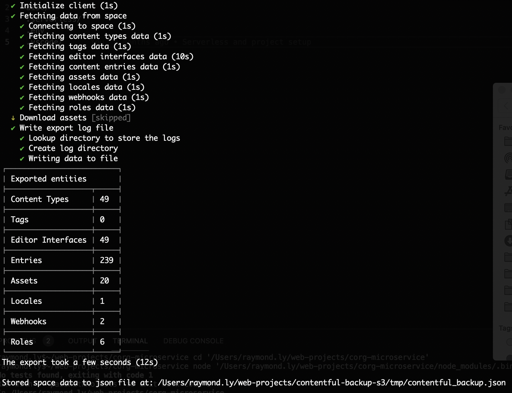

# Contentful Backup to S3

## Tech Stack

- AWS Lambda
- Node.js
- Serverless Framework
- TypeScript
- Jest
- Yarn

## Prerequisites

- Node v14+ installed.

## Getting Started

### Local
1. Install dependencies: `yarn`
1. Create an `.env` file and copy variables from `.env.example`
1. Build the microservice locally: `yarn invoke:exportContentfulSpace`
1. This will export the contentful space into a JSON file under `./tmp` directory

### AWS Lambda Deploy
1. Ensure you have an `AWS_ACCESS_KEY_ID` and `AWS_SECRET_ACCESS_KEY` set up with read/write permissions for API Gateway and Lambda.
1. Deploy the microservice to AWS Lambda: `yarn serverless deploy`
1. Checkout the microservice by running the endpoint that it creates on your first deploy.

(Note: the endpoint can be configured to a custom endpoint via AWS Route 53.)

## Unit Tests

- Run all Tests: `yarn test`

- Run single Test: `yarn test <TestRelativePath>`

## Linting

- Using airbnb linting with custom TypeScript configs, run: `yarn lint`
